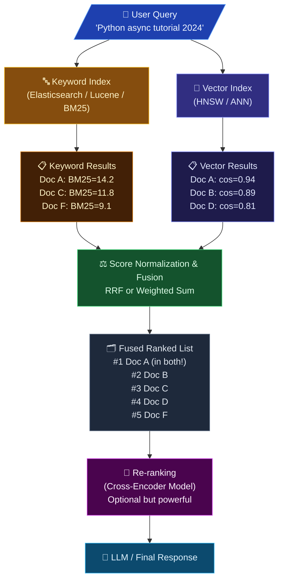
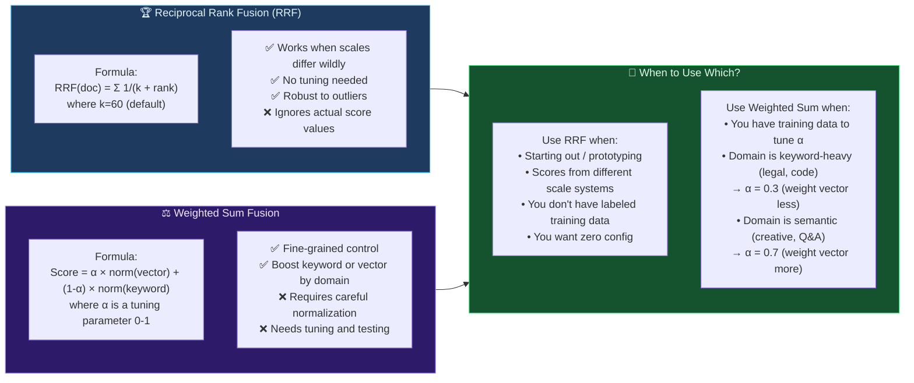
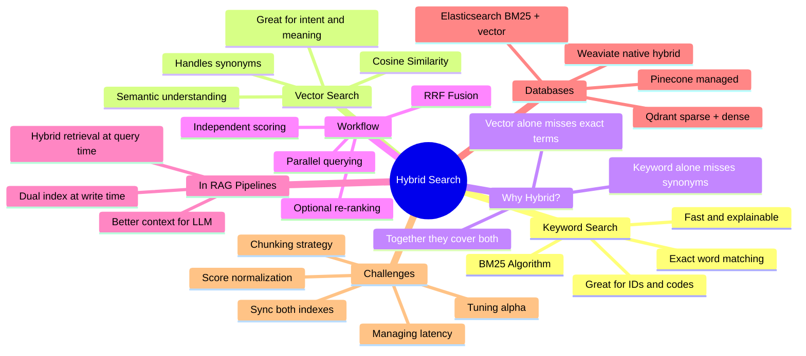

# 🔍 Hybrid Search: Combining Keyword and Vector Search for Accuracy

> **Who is this for?** Anyone curious about how modern AI search works — no PhD required. Junior developers will also find working examples and diagrams to build on.

---

# 1. Why Vector Search Alone Is Not Enough

---

## 1a. What Is Vector Search?

Imagine you're trying to find a song that *feels* like a rainy Sunday afternoon. You can't just search for the word "rain" — you want something that *captures the mood*. That's what **Vector Search** does.

It converts text (or images, audio, etc.) into a list of numbers called a **vector** (also called an *embedding*). Similar meanings produce similar number patterns. The search engine then finds items whose number patterns are closest to your query's number pattern.

```svg
<svg viewBox="0 0 700 280" xmlns="http://www.w3.org/2000/svg" font-family="monospace" font-size="13">
  <!-- Background -->
  <rect width="700" height="280" fill="#0f172a" rx="12"/>

  <!-- Title -->
  <text x="350" y="30" text-anchor="middle" fill="#94a3b8" font-size="14" font-weight="bold">Vector Search: Words → Numbers → Similarity</text>

  <!-- Query box -->
  <rect x="20" y="55" width="160" height="45" fill="#1e40af" rx="8"/>
  <text x="100" y="73" text-anchor="middle" fill="#bfdbfe" font-size="12" font-weight="bold">Query</text>
  <text x="100" y="91" text-anchor="middle" fill="#eff6ff" font-size="11">"dog running fast"</text>

  <!-- Arrow -->
  <line x1="180" y1="77" x2="230" y2="77" stroke="#38bdf8" stroke-width="2" marker-end="url(#arr)"/>
  <defs>
    <marker id="arr" markerWidth="8" markerHeight="8" refX="6" refY="3" orient="auto">
      <path d="M0,0 L0,6 L8,3 z" fill="#38bdf8"/>
    </marker>
    <marker id="arr2" markerWidth="8" markerHeight="8" refX="6" refY="3" orient="auto">
      <path d="M0,0 L0,6 L8,3 z" fill="#a78bfa"/>
    </marker>
  </defs>

  <!-- Embedding box -->
  <rect x="230" y="50" width="180" height="55" fill="#1e293b" rx="8" stroke="#38bdf8" stroke-width="1"/>
  <text x="320" y="70" text-anchor="middle" fill="#38bdf8" font-size="11" font-weight="bold">Embedding Model</text>
  <text x="320" y="88" text-anchor="middle" fill="#64748b" font-size="10">[0.82, -0.14, 0.67,</text>
  <text x="320" y="100" text-anchor="middle" fill="#64748b" font-size="10"> 0.33, 0.91, ...]</text>

  <!-- Arrow -->
  <line x1="410" y1="77" x2="460" y2="77" stroke="#38bdf8" stroke-width="2" marker-end="url(#arr)"/>

  <!-- Vector DB -->
  <rect x="460" y="45" width="220" height="165" fill="#1e293b" rx="8" stroke="#6366f1" stroke-width="1"/>
  <text x="570" y="68" text-anchor="middle" fill="#a5b4fc" font-size="12" font-weight="bold">Vector Database</text>

  <!-- Doc vectors -->
  <rect x="475" y="78" width="190" height="30" fill="#312e81" rx="5"/>
  <text x="485" y="91" fill="#c7d2fe" font-size="10">🐕 "puppy sprinting in park"</text>
  <text x="485" y="103" fill="#4ade80" font-size="10">similarity: 0.94 ✓ TOP MATCH</text>

  <rect x="475" y="115" width="190" height="30" fill="#1e293b" rx="5" stroke="#374151"/>
  <text x="485" y="128" fill="#94a3b8" font-size="10">🐈 "cat sleeping on sofa"</text>
  <text x="485" y="140" fill="#f87171" font-size="10">similarity: 0.21</text>

  <rect x="475" y="152" width="190" height="30" fill="#312e81" rx="5"/>
  <text x="485" y="165" fill="#c7d2fe" font-size="10">🏃 "athlete racing at top speed"</text>
  <text x="485" y="177" fill="#fbbf24" font-size="10">similarity: 0.87 ✓ MATCH</text>

  <rect x="475" y="189" width="190" height="13" fill="#1e293b" rx="5"/>
  <text x="570" y="199" text-anchor="middle" fill="#475569" font-size="9">... more documents ...</text>

  <!-- Bottom note -->
  <text x="350" y="248" text-anchor="middle" fill="#64748b" font-size="11">No exact word "dog" needed — meaning is matched!</text>
  <text x="350" y="265" text-anchor="middle" fill="#475569" font-size="10">"puppy sprinting" ≈ "dog running fast" in meaning</text>
</svg>
```

### #examples# of Vector Search

| You type... | Vector Search also finds... | Why? |
|---|---|---|
| `"dog running fast"` | "puppy sprinting in park" | Same *meaning*, different words |
| `"cheap flights"` | "affordable air travel deals" | Synonyms caught by meaning |
| `"heart attack symptoms"` | "signs of myocardial infarction" | Medical jargon matched to plain English |
| `"I'm feeling blue"` | Articles about sadness/depression | Idiom understood semantically |
| `"best way to lose weight"` | "healthy tips to reduce body fat" | Intent matched, not just words |

---

### #explain# Some Algorithms of Vector Search

Think of vectors as **coordinates on a map**. If your query is at point (3, 5) on the map, vector search finds documents closest to that point.

#### 🔵 Cosine Similarity

> "Are we pointing in the same direction?"

Imagine two arrows drawn from the center of a circle. Cosine similarity measures the *angle* between them — not how long they are, just the direction.

**Score = 1.0** → Perfect match (same direction)
**Score = 0.0** → No relation (perpendicular)
**Score = -1.0** → Opposite meaning

```svg
<svg viewBox="0 0 400 260" xmlns="http://www.w3.org/2000/svg" font-family="sans-serif">
  <rect width="400" height="260" fill="#0f172a" rx="10"/>
  <text x="200" y="25" text-anchor="middle" fill="#94a3b8" font-size="13" font-weight="bold">Cosine Similarity</text>

  <!-- Axes -->
  <line x1="50" y1="200" x2="350" y2="200" stroke="#334155" stroke-width="1.5"/>
  <line x1="200" y1="30" x2="200" y2="215" stroke="#334155" stroke-width="1.5"/>
  <text x="355" y="204" fill="#475569" font-size="11">x</text>
  <text x="204" y="28" fill="#475569" font-size="11">y</text>
  <text x="196" y="215" fill="#475569" font-size="10">0</text>

  <!-- Query vector -->
  <line x1="200" y1="200" x2="300" y2="80" stroke="#38bdf8" stroke-width="2.5" marker-end="url(#blarr)"/>
  <text x="305" y="75" fill="#38bdf8" font-size="11">Query</text>
  <defs>
    <marker id="blarr" markerWidth="7" markerHeight="7" refX="5" refY="3" orient="auto">
      <path d="M0,0 L0,6 L7,3 z" fill="#38bdf8"/>
    </marker>
    <marker id="grarr" markerWidth="7" markerHeight="7" refX="5" refY="3" orient="auto">
      <path d="M0,0 L0,6 L7,3 z" fill="#4ade80"/>
    </marker>
    <marker id="redarr" markerWidth="7" markerHeight="7" refX="5" refY="3" orient="auto">
      <path d="M0,0 L0,6 L7,3 z" fill="#f87171"/>
    </marker>
    <marker id="yelarr" markerWidth="7" markerHeight="7" refX="5" refY="3" orient="auto">
      <path d="M0,0 L0,6 L7,3 z" fill="#fbbf24"/>
    </marker>
  </defs>

  <!-- Doc A - very similar -->
  <line x1="200" y1="200" x2="285" y2="70" stroke="#4ade80" stroke-width="2" marker-end="url(#grarr)"/>
  <text x="288" y="67" fill="#4ade80" font-size="10">Doc A (0.97)</text>

  <!-- Doc B - somewhat similar -->
  <line x1="200" y1="200" x2="330" y2="130" stroke="#fbbf24" stroke-width="2" marker-end="url(#yelarr)"/>
  <text x="333" y="128" fill="#fbbf24" font-size="10">Doc B (0.71)</text>

  <!-- Doc C - not similar -->
  <line x1="200" y1="200" x2="90" y2="110" stroke="#f87171" stroke-width="2" marker-end="url(#redarr)"/>
  <text x="40" y="107" fill="#f87171" font-size="10">Doc C (0.12)</text>

  <!-- Angle arc -->
  <path d="M 235 167 A 35 35 0 0 0 225 162" stroke="#a78bfa" stroke-width="1.5" fill="none"/>
  <text x="245" y="162" fill="#a78bfa" font-size="10">small angle</text>
  <text x="245" y="173" fill="#a78bfa" font-size="10">= similar!</text>

  <text x="200" y="248" text-anchor="middle" fill="#475569" font-size="10">Small angle between vectors = high similarity score</text>
</svg>
```

**Examples:**
- `"dog running"` vs `"puppy sprinting"` → cosine ≈ 0.94
- `"dog running"` vs `"quantum physics"` → cosine ≈ 0.05

---

#### 🟣 ANN — Approximate Nearest Neighbor (HNSW, IVF)

> "Don't check every single point — be smart about it."

A vector database can have *millions* of documents. Checking each one is too slow. ANN algorithms build a clever map so the search can jump to the right neighborhood quickly.

**HNSW** (Hierarchical Navigable Small World) works like a city map:
- Top level: Countries → narrow it to a continent
- Middle level: Cities → narrow it to a district
- Bottom level: Streets → find the exact house

**Examples:**
- Used by **Pinecone**, **Weaviate**, **Qdrant**, **Milvus**
- Can search 10 million documents in under 10ms
- Trade-off: ~95% accurate (misses a tiny fraction) vs 100% slow brute-force

---

## 1b. What Is Keyword Search?

Keyword search is the **old-school librarian** approach. It looks for the *exact words* you typed — nothing more, nothing less. It's how Google worked in the early 2000s, and it's still what powers many search bars today.

```svg
<svg viewBox="0 0 680 230" xmlns="http://www.w3.org/2000/svg" font-family="monospace" font-size="12">
  <rect width="680" height="230" fill="#0f172a" rx="12"/>
  <text x="340" y="28" text-anchor="middle" fill="#94a3b8" font-size="14" font-weight="bold">Keyword Search: Find the Exact Words</text>

  <!-- Query -->
  <rect x="15" y="45" width="155" height="40" fill="#854d0e" rx="7"/>
  <text x="92" y="62" text-anchor="middle" fill="#fef3c7" font-size="11" font-weight="bold">Query</text>
  <text x="92" y="78" text-anchor="middle" fill="#fde68a" font-size="11">"Python tutorial"</text>

  <defs>
    <marker id="oa" markerWidth="7" markerHeight="7" refX="5" refY="3" orient="auto">
      <path d="M0,0 L0,6 L7,3 z" fill="#f59e0b"/>
    </marker>
  </defs>
  <line x1="170" y1="65" x2="210" y2="65" stroke="#f59e0b" stroke-width="2" marker-end="url(#oa)"/>

  <!-- Index -->
  <rect x="210" y="38" width="200" height="135" fill="#1e293b" rx="8" stroke="#f59e0b" stroke-width="1"/>
  <text x="310" y="58" text-anchor="middle" fill="#fbbf24" font-size="11" font-weight="bold">Inverted Index</text>

  <text x="220" y="76" fill="#64748b" font-size="10">python → [doc1, doc3, doc7]</text>
  <text x="220" y="92" fill="#64748b" font-size="10">tutorial → [doc1, doc2, doc9]</text>
  <text x="220" y="108" fill="#64748b" font-size="10">java → [doc4, doc5]</text>
  <text x="220" y="124" fill="#64748b" font-size="10">guide → [doc2, doc6, doc8]</text>
  <text x="220" y="140" fill="#fbbf24" font-size="10" font-weight="bold">Match: doc1 has BOTH words ✓</text>
  <text x="220" y="156" fill="#475569" font-size="10">↳ doc1 ranked #1</text>

  <line x1="410" y1="65" x2="450" y2="65" stroke="#f59e0b" stroke-width="2" marker-end="url(#oa)"/>

  <!-- Results -->
  <rect x="450" y="38" width="215" height="135" fill="#1e293b" rx="8" stroke="#22c55e" stroke-width="1"/>
  <text x="557" y="58" text-anchor="middle" fill="#86efac" font-size="11" font-weight="bold">Results</text>

  <rect x="460" y="65" width="195" height="25" fill="#14532d" rx="4"/>
  <text x="470" y="79" fill="#4ade80" font-size="10">✓ doc1: "Python Tutorial for Beginners"</text>
  <text x="470" y="90" fill="#94a3b8" font-size="9">BM25 score: 14.2</text>

  <rect x="460" y="100" width="195" height="25" fill="#1e293b" rx="4" stroke="#374151"/>
  <text x="470" y="114" fill="#94a3b8" font-size="10">✗ "Learn Python the Hard Way"</text>
  <text x="470" y="125" fill="#64748b" font-size="9">Missing "tutorial" → not returned</text>

  <rect x="460" y="135" width="195" height="25" fill="#1e293b" rx="4" stroke="#374151"/>
  <text x="470" y="149" fill="#94a3b8" font-size="10">✗ "Beginner's guide to coding"</text>
  <text x="470" y="160" fill="#64748b" font-size="9">Missing "Python" → not returned</text>

  <text x="340" y="210" text-anchor="middle" fill="#475569" font-size="10">Exact word match — fast, precise, but rigid</text>
</svg>
```

### #examples# of Keyword Search

| You type... | Keyword Search returns... | What it misses... |
|---|---|---|
| `"Python tutorial"` | Pages with both exact words | "Learn Python" (no "tutorial" word) |
| `"heart attack"` | Articles saying "heart attack" | "myocardial infarction" (same thing!) |
| `"cheap hotel"` | Pages with "cheap" + "hotel" | "budget accommodation" |
| `"fix TypeError"` | Stack Overflow with "TypeError" | Threads describing the same error differently |
| `"AWS error code 403"` | Pages with "403" + "AWS" | "Access Denied on S3 bucket" explanations |

---

### #explain# Some Algorithms of Keyword Search

#### 📊 TF-IDF (Term Frequency – Inverse Document Frequency)

> "A word is important if it appears often in *this* doc but rarely in *all* docs."

**TF** = How often the word appears in your document
**IDF** = How rare the word is across all documents

- "the", "is", "a" → low IDF (common everywhere) → low score
- "photosynthesis" → high IDF (rare word) → high score

**Examples:**
- Doc: "Python is great. Python is fast. Python is fun."
  - "Python" TF = 3/9 = 0.33 → high frequency → gets a good score
  - "is" TF = 3/9 = 0.33 → common word, near-zero IDF → low score

---

#### 🏆 BM25 (Best Match 25) — The Gold Standard

> "Like TF-IDF, but smarter. It punishes very long documents."

BM25 is the algorithm behind **Elasticsearch** and **Lucene**. It improves on TF-IDF by:
1. Capping how much repetition helps (mentioning a word 100x isn't 100x better than 10x)
2. Normalizing for document length (a 10,000-word doc shouldn't just win by having more words)

**Examples:**

| Document | Query: "Python tutorial" | BM25 score |
|---|---|---|
| "Python tutorial for absolute beginners" | Both words, short doc | 14.2 |
| "Python programming guide and tutorial and tutorial..." (repeated 50x) | Repetition capped | 8.1 |
| "This massive 10,000 word Python tutorial guide..." | Length normalized | 11.4 |

---

## 1c. Why We Need Hybrid Search

### 😤 #explain# + #examples# — Keyword Search Alone Frustrates Users

Keyword search is like a **very literal-minded assistant** who only does *exactly* what you say.

```svg
<svg viewBox="0 0 660 300" xmlns="http://www.w3.org/2000/svg" font-family="sans-serif" font-size="12">
  <rect width="660" height="300" fill="#0f172a" rx="12"/>
  <text x="330" y="28" text-anchor="middle" fill="#f87171" font-size="14" font-weight="bold">😤 Keyword Search Failures</text>

  <!-- Case 1 -->
  <rect x="15" y="45" width="300" height="110" fill="#1e293b" rx="8" stroke="#ef4444" stroke-width="1"/>
  <text x="165" y="63" text-anchor="middle" fill="#fca5a5" font-size="11" font-weight="bold">❌ Synonym Problem</text>
  <text x="25" y="82" fill="#94a3b8" font-size="10">User types: "sofa"</text>
  <text x="25" y="97" fill="#94a3b8" font-size="10">Returned: 0 results</text>
  <text x="25" y="112" fill="#64748b" font-size="10">In database: "couch", "settee",</text>
  <text x="25" y="126" fill="#64748b" font-size="10">"loveseat" — all mean the same!</text>
  <text x="25" y="141" fill="#f87171" font-size="10">User thinks: "Is this site broken?"</text>

  <!-- Case 2 -->
  <rect x="345" y="45" width="300" height="110" fill="#1e293b" rx="8" stroke="#ef4444" stroke-width="1"/>
  <text x="495" y="63" text-anchor="middle" fill="#fca5a5" font-size="11" font-weight="bold">❌ Plural/Typo Problem</text>
  <text x="355" y="82" fill="#94a3b8" font-size="10">User types: "runnings shoes" (typo)</text>
  <text x="355" y="97" fill="#94a3b8" font-size="10">Returned: 0 results</text>
  <text x="355" y="112" fill="#64748b" font-size="10">In database: "running shoes",</text>
  <text x="355" y="126" fill="#64748b" font-size="10">"athletic footwear"</text>
  <text x="355" y="141" fill="#f87171" font-size="10">User thinks: "This store has nothing."</text>

  <!-- Case 3 -->
  <rect x="15" y="170" width="300" height="110" fill="#1e293b" rx="8" stroke="#ef4444" stroke-width="1"/>
  <text x="165" y="188" text-anchor="middle" fill="#fca5a5" font-size="11" font-weight="bold">❌ Intent Problem</text>
  <text x="25" y="207" fill="#94a3b8" font-size="10">User types: "my laptop is so slow"</text>
  <text x="25" y="222" fill="#94a3b8" font-size="10">Keyword returns: literal matches</text>
  <text x="25" y="237" fill="#64748b" font-size="10">for "slow laptop" — maybe nothing</text>
  <text x="25" y="252" fill="#64748b" font-size="10">useful! User wants: "how to speed</text>
  <text x="25" y="267" fill="#64748b" font-size="10">up laptop" guides</text>

  <!-- Case 4 -->
  <rect x="345" y="170" width="300" height="110" fill="#1e293b" rx="8" stroke="#ef4444" stroke-width="1"/>
  <text x="495" y="188" text-anchor="middle" fill="#fca5a5" font-size="11" font-weight="bold">❌ Language Barrier</text>
  <text x="355" y="207" fill="#94a3b8" font-size="10">User types: "voiture" (French: car)</text>
  <text x="355" y="222" fill="#94a3b8" font-size="10">English DB returns: 0 results</text>
  <text x="355" y="237" fill="#64748b" font-size="10">Hundreds of "car" articles exist</text>
  <text x="355" y="252" fill="#64748b" font-size="10">but keyword can't bridge</text>
  <text x="355" y="267" fill="#f87171" font-size="10">the language gap</text>
</svg>
```

---

### 🤖 #explain# + #examples# — Vector Search Alone Has Blind Spots

Vector search is like a **very creative assistant** who always tries to find *something similar* — even when you need *exact*.

**Limitation 1 — Struggles with Specific Keywords (SKUs, Names, Codes)**

```
User: "Show me product SKU-4892-B"
Vector search: Returns "similar products" in the same category
Problem: SKU-4892-B is an exact identifier — similarity is useless here!
```

| Query | Vector returns (wrong!) | User actually wants |
|---|---|---|
| `"Error code NX-403"` | Similar error descriptions | The exact doc for NX-403 |
| `"Invoice #INV-2024-0019"` | Similar invoices | That specific invoice |
| `"CVE-2023-44487"` | Related security issues | The exact vulnerability record |
| `"SWIFT code CITIUS33"` | Similar bank identifiers | That exact bank |

**Limitation 2 — Lack of Domain & Business Knowledge**

> Vector models are trained on general internet data. They don't know *your* company's jargon.

- Your company calls a feature "Turbo Mode" — the model has no idea what this means
- Your internal tool is called "Phoenix" — vector search returns mythology articles
- Medical records use abbreviations ("MI", "CABG") the general model doesn't embed well

**Limitation 3 — Temporal Context (Time-Sensitive Searches)**

> "Latest", "newest", "2024" — vectors don't know *when* things happened.

| Query | Vector problem | Keyword helps |
|---|---|---|
| `"Python 3.12 release notes"` | Returns older Python docs too (semantically similar) | "3.12" exact match filters correctly |
| `"Q4 2024 earnings report"` | Returns all earnings reports | Exact quarter + year match |
| `"COVID variant XBB.1.5"` | Returns general COVID content | Exact variant name match |

---

### ✅ #explain# + #examples# — Hybrid Search Uses the Strengths of Both

```svg
<svg viewBox="0 0 700 320" xmlns="http://www.w3.org/2000/svg" font-family="sans-serif" font-size="12">
  <rect width="700" height="320" fill="#0f172a" rx="12"/>
  <text x="350" y="28" text-anchor="middle" fill="#a3e635" font-size="14" font-weight="bold">✅ Hybrid Search = Best of Both Worlds</text>

  <!-- Keyword circle -->
  <ellipse cx="210" cy="170" rx="170" ry="110" fill="#1e3a5f" opacity="0.8" stroke="#38bdf8" stroke-width="1.5"/>
  <text x="110" y="130" fill="#7dd3fc" font-size="11" font-weight="bold">Keyword Search</text>
  <text x="80" y="148" fill="#93c5fd" font-size="10">✓ Exact matches</text>
  <text x="80" y="163" fill="#93c5fd" font-size="10">✓ SKU / codes / IDs</text>
  <text x="80" y="178" fill="#93c5fd" font-size="10">✓ Dates and versions</text>
  <text x="80" y="193" fill="#93c5fd" font-size="10">✓ Proper nouns</text>
  <text x="80" y="208" fill="#93c5fd" font-size="10">✓ Fast and explainable</text>

  <!-- Vector circle -->
  <ellipse cx="490" cy="170" rx="170" ry="110" fill="#2d1b69" opacity="0.8" stroke="#a78bfa" stroke-width="1.5"/>
  <text x="500" y="130" fill="#c4b5fd" font-size="11" font-weight="bold">Vector Search</text>
  <text x="480" y="148" fill="#ddd6fe" font-size="10">✓ Synonyms</text>
  <text x="480" y="163" fill="#ddd6fe" font-size="10">✓ Paraphrasing</text>
  <text x="480" y="178" fill="#ddd6fe" font-size="10">✓ Intent understanding</text>
  <text x="480" y="193" fill="#ddd6fe" font-size="10">✓ Multi-language</text>
  <text x="480" y="208" fill="#ddd6fe" font-size="10">✓ Conceptual queries</text>

  <!-- Overlap / Hybrid zone -->
  <ellipse cx="350" cy="170" rx="60" ry="60" fill="#1a1a2e" stroke="#a3e635" stroke-width="2" opacity="0.9"/>
  <text x="350" y="158" text-anchor="middle" fill="#a3e635" font-size="10" font-weight="bold">HYBRID</text>
  <text x="350" y="172" text-anchor="middle" fill="#84cc16" font-size="9">Fusion &amp;</text>
  <text x="350" y="184" text-anchor="middle" fill="#84cc16" font-size="9">Re-ranking</text>

  <!-- Examples at bottom -->
  <rect x="15" y="285" width="660" height="25" fill="#1e293b" rx="5"/>
  <text x="350" y="302" text-anchor="middle" fill="#64748b" font-size="10">Example: "Python 3.12 async features" → keyword catches "3.12", vector catches "async concurrent programming concepts"</text>
</svg>
```

**Real-World Hybrid Search Wins:**

| User Query | Keyword Contribution | Vector Contribution | Combined Result |
|---|---|---|---|
| `"Python 3.12 async features"` | Pins "3.12" correctly | Finds conceptual content on async/await | Perfect targeted result |
| `"chest pain when climbing stairs"` | Finds "chest pain" exact articles | Understands "exercise-induced angina" | Doctor-quality results |
| `"cheap flights JFK to LAX"` | Pins airport codes JFK + LAX | Finds "affordable air travel" content | Correct route, right price |
| `"how to fix the spinning wheel on Mac"` | "Mac" exact match | Understands "spinning pinwheel = frozen app" | Right OS, right fix |

---

# 2. Hybrid Search Workflow

The magic of Hybrid Search is in *how* the two systems work together. Let's walk through each step.

---



### Step-by-Step Breakdown

**Step 1 — Parallel Querying**
Your query goes to *two* systems at the same time (like asking two librarians simultaneously):
- **Librarian A (Keyword):** Scans the word index, finds BM25 scores
- **Librarian B (Vector):** Converts your query to numbers, finds cosine similarities

**Step 2 — Independent Scoring**
Each returns their own list with their own scores. The scores look completely different:
- Keyword: `Doc A = 14.2`, `Doc C = 11.8` ← these are BM25 counts
- Vector: `Doc A = 0.94`, `Doc B = 0.89` ← these are 0-to-1 cosine scores

**Step 3 — Score Normalization & Fusion** (The hard part!)
You can't compare `14.2` and `0.94` directly. A fusion algorithm merges the two ranked lists.

**Step 4 — Re-ranking** (Optional)
A smarter AI model reads the top results again and re-orders them for maximum accuracy.

---

### #examples# — Let's Trace a Real Query

**Query:** `"async Python concurrency guide 2024"`

| Step | What Happens | Results |
|---|---|---|
| Keyword search | Finds "2024", "async", "Python" | Doc1(BM25=15.1), Doc3(BM25=12.0), Doc7(BM25=8.3) |
| Vector search | Finds similar meaning to "concurrent programming" | Doc2(cos=0.91), Doc1(cos=0.88), Doc5(cos=0.79) |
| Fusion (RRF) | Doc1 appears in BOTH lists → gets boosted | **Doc1 #1**, Doc2 #2, Doc3 #3 |
| Re-ranking | Cross-encoder reads Doc1, Doc2, Doc3 carefully | Final order confirmed: **Doc1 is perfect** |

---

### #diagram# — RRF vs Weighted Sum: Which Fusion to Use?



**Concrete Example — RRF in action:**

Documents after keyword search: `[DocA rank=1, DocC rank=2, DocF rank=3]`
Documents after vector search: `[DocB rank=1, DocA rank=2, DocD rank=3]`

RRF scores (k=60):
- DocA: 1/(60+1) + 1/(60+2) = **0.0164 + 0.0161 = 0.0325** ← WINS (appears in both)
- DocB: 0 + 1/(60+1) = **0.0164**
- DocC: 1/(60+2) + 0 = **0.0161**

**DocA wins because it appeared in BOTH lists**, even if it wasn't #1 in either!

---

# 3. Hybrid Search in RAG Pipelines

---

### #diagram# — AS-IS vs TO-BE RAG Architecture

```mermaid
flowchart LR
    subgraph ASIS["❌ AS-IS: Vector-Only RAG"]
        direction TB
        subgraph IDX1["Phase 1: Index"]
            A1["📄 Documents"] --> A2["✂️ Chunking"]
            A2 --> A3["🧠 Embedding Model"]
            A3 --> A4[("🗄️ Vector DB Only")]
        end
        subgraph RET1["Phase 2: Retrieve"]
            B1["❓ User Query"] --> B2["🔢 Query Embedding"]
            B2 --> B3["🔍 Vector Search Only"]
            A4 --> B3
            B3 --> B4["📝 Context"]
            B4 --> B5["🤖 LLM Answer"]
        end
    end

    subgraph TOBE["✅ TO-BE: Hybrid RAG"]
        direction TB
        subgraph IDX2["Phase 1: Index"]
            C1["📄 Documents"] --> C2["✂️ Chunking"]
            C2 --> C3["🧠 Embedding"]
            C2 --> C6["🔤 BM25 Tokenizing"]
            C3 --> C4[("🗄️ Vector DB")]
            C6 --> C7[("📚 Keyword Index")]
        end
        subgraph RET2["Phase 2: Retrieve"]
            D1["❓ User Query"] --> D2["🔢 Query Embedding"]
            D1 --> D6["🔤 Keyword Parse"]
            D2 --> D3["🔍 Vector Search"]
            D6 --> D7["🔤 Keyword Search"]
            C4 --> D3
            C7 --> D7
            D3 --> D8["⚖️ Hybrid Fusion\n(RRF / Weighted Sum)"]
            D7 --> D8
            D8 --> D9["🎯 Re-ranking"]
            D9 --> D10["📝 Context"]
            D10 --> D11["🤖 LLM Answer"]
        end
    end

    style ASIS fill:#1a0a0a,stroke:#ef4444,color:#fca5a5
    style TOBE fill:#0a1a0a,stroke:#22c55e,color:#86efac
    style IDX1 fill:#1f1212,stroke:#dc2626
    style RET1 fill:#1f1212,stroke:#dc2626
    style IDX2 fill:#0f1f0f,stroke:#16a34a
    style RET2 fill:#0f1f0f,stroke:#16a34a
```



---

### #explain# — Which Database Supports What?

Different databases handle **dense** (vector) and **sparse** (keyword) search differently:

> 🟦 **Dense** = Vector search (floating-point embeddings, like [0.1, 0.8, -0.3, ...])
> 🟧 **Sparse** = Keyword/BM25 search (word counts, like {"python": 3, "tutorial": 1})

```svg
<svg viewBox="0 0 700 340" xmlns="http://www.w3.org/2000/svg" font-family="sans-serif" font-size="11">
  <rect width="700" height="340" fill="#0f172a" rx="12"/>
  <text x="350" y="26" text-anchor="middle" fill="#94a3b8" font-size="13" font-weight="bold">Database Comparison: Dense vs Sparse Support</text>

  <!-- Header row -->
  <rect x="10" y="38" width="680" height="28" fill="#1e293b" rx="5"/>
  <text x="120" y="57" text-anchor="middle" fill="#64748b" font-size="11" font-weight="bold">Database</text>
  <text x="270" y="57" text-anchor="middle" fill="#38bdf8" font-size="11" font-weight="bold">Dense (Vector)</text>
  <text x="400" y="57" text-anchor="middle" fill="#fb923c" font-size="11" font-weight="bold">Sparse (Keyword)</text>
  <text x="540" y="57" text-anchor="middle" fill="#a3e635" font-size="11" font-weight="bold">Best For</text>

  <!-- Row data -->
  <!-- PostgreSQL + pgvector -->
  <rect x="10" y="70" width="680" height="34" fill="#1e293b" rx="4" opacity="0.6"/>
  <text x="120" y="90" text-anchor="middle" fill="#e2e8f0" font-size="11">PostgreSQL + pgvector</text>
  <text x="270" y="90" text-anchor="middle" fill="#4ade80" font-size="14">✓</text>
  <text x="400" y="90" text-anchor="middle" fill="#fbbf24" font-size="11">Limited (FTS)</text>
  <text x="540" y="88" text-anchor="middle" fill="#94a3b8" font-size="9">Existing SQL apps, small scale</text>
  <text x="540" y="99" text-anchor="middle" fill="#64748b" font-size="9">Already using Postgres</text>

  <!-- Elasticsearch -->
  <rect x="10" y="108" width="680" height="34" fill="#1e293b" rx="4" opacity="0.8"/>
  <text x="120" y="128" text-anchor="middle" fill="#e2e8f0" font-size="11">Elasticsearch</text>
  <text x="270" y="128" text-anchor="middle" fill="#4ade80" font-size="14">✓</text>
  <text x="400" y="128" text-anchor="middle" fill="#4ade80" font-size="14">✓✓ (native BM25)</text>
  <text x="540" y="126" text-anchor="middle" fill="#94a3b8" font-size="9">Log search, enterprise full-text</text>
  <text x="540" y="137" text-anchor="middle" fill="#64748b" font-size="9">Already using ELK stack</text>

  <!-- Weaviate -->
  <rect x="10" y="146" width="680" height="34" fill="#1e293b" rx="4" opacity="0.6"/>
  <text x="120" y="166" text-anchor="middle" fill="#e2e8f0" font-size="11">Weaviate</text>
  <text x="270" y="166" text-anchor="middle" fill="#4ade80" font-size="14">✓✓ native</text>
  <text x="400" y="166" text-anchor="middle" fill="#4ade80" font-size="14">✓ BM25</text>
  <text x="540" y="164" text-anchor="middle" fill="#94a3b8" font-size="9">AI-native apps, RAG pipelines</text>
  <text x="540" y="175" text-anchor="middle" fill="#64748b" font-size="9">Hybrid built-in, GraphQL API</text>

  <!-- Pinecone -->
  <rect x="10" y="184" width="680" height="34" fill="#1e293b" rx="4" opacity="0.8"/>
  <text x="120" y="204" text-anchor="middle" fill="#e2e8f0" font-size="11">Pinecone</text>
  <text x="270" y="204" text-anchor="middle" fill="#4ade80" font-size="14">✓✓ managed</text>
  <text x="400" y="204" text-anchor="middle" fill="#4ade80" font-size="14">✓ sparse vectors</text>
  <text x="540" y="202" text-anchor="middle" fill="#94a3b8" font-size="9">Serverless, fully managed</text>
  <text x="540" y="213" text-anchor="middle" fill="#64748b" font-size="9">Don't want to manage infra</text>

  <!-- Milvus -->
  <rect x="10" y="222" width="680" height="34" fill="#1e293b" rx="4" opacity="0.6"/>
  <text x="120" y="242" text-anchor="middle" fill="#e2e8f0" font-size="11">Milvus</text>
  <text x="270" y="242" text-anchor="middle" fill="#4ade80" font-size="14">✓✓ HNSW</text>
  <text x="400" y="242" text-anchor="middle" fill="#fbbf24" font-size="11">Partial (BM25 beta)</text>
  <text x="540" y="240" text-anchor="middle" fill="#94a3b8" font-size="9">Billion-scale, high performance</text>
  <text x="540" y="251" text-anchor="middle" fill="#64748b" font-size="9">Large-scale self-hosted</text>

  <!-- Qdrant -->
  <rect x="10" y="260" width="680" height="34" fill="#1e293b" rx="4" opacity="0.8"/>
  <text x="120" y="280" text-anchor="middle" fill="#e2e8f0" font-size="11">Qdrant</text>
  <text x="270" y="280" text-anchor="middle" fill="#4ade80" font-size="14">✓✓ HNSW</text>
  <text x="400" y="280" text-anchor="middle" fill="#4ade80" font-size="14">✓ sparse vectors</text>
  <text x="540" y="278" text-anchor="middle" fill="#94a3b8" font-size="9">Rust-native, fast + open source</text>
  <text x="540" y="289" text-anchor="middle" fill="#64748b" font-size="9">Performance-critical self-hosted</text>

  <text x="350" y="318" text-anchor="middle" fill="#475569" font-size="10">✓✓ = native, production-ready support &nbsp;|&nbsp; ✓ = supported but may need setup &nbsp;|&nbsp; Limited = workarounds needed</text>
</svg>
```

**When to use which:**

| Situation | Recommended DB | Reason |
|---|---|---|
| Already using Postgres | **pgvector** | Minimal change, SQL stays the same |
| Log search + AI features | **Elasticsearch** | BM25 is battle-tested, vector is added on |
| New AI-native RAG app | **Weaviate** or **Qdrant** | Hybrid search first-class feature |
| Fully managed, no ops | **Pinecone** | Serverless, scales automatically |
| Billions of vectors | **Milvus** | Built for massive scale |

---

### #explain# + #examples# — Challenges with Hybrid Search

Real life isn't always smooth. Here are the 5 hardest problems engineers face:

---

#### ⚠️ Challenge 1: Dual Index Synchronization

> "When a document updates, BOTH indexes must update — or they drift out of sync."

```svg
<svg viewBox="0 0 680 200" xmlns="http://www.w3.org/2000/svg" font-family="sans-serif" font-size="11">
  <rect width="680" height="200" fill="#0f172a" rx="10"/>
  <text x="340" y="25" text-anchor="middle" fill="#f87171" font-size="12" font-weight="bold">⚠️ Sync Problem: Indexes Getting Out of Step</text>

  <!-- Doc Update -->
  <rect x="15" y="40" width="130" height="50" fill="#7f1d1d" rx="7" stroke="#ef4444"/>
  <text x="80" y="60" text-anchor="middle" fill="#fca5a5" font-size="10" font-weight="bold">Document Updated</text>
  <text x="80" y="75" text-anchor="middle" fill="#fecaca" font-size="9">"New return policy"</text>
  <text x="80" y="88" text-anchor="middle" fill="#fecaca" font-size="9">saved to database</text>

  <defs><marker id="ra" markerWidth="7" markerHeight="7" refX="5" refY="3" orient="auto"><path d="M0,0 L0,6 L7,3 z" fill="#94a3b8"/></marker></defs>

  <!-- Vector Index updated -->
  <line x1="145" y1="65" x2="185" y2="65" stroke="#4ade80" stroke-width="2" marker-end="url(#ra)"/>
  <rect x="185" y="40" width="160" height="50" fill="#14532d" rx="7" stroke="#22c55e"/>
  <text x="265" y="60" text-anchor="middle" fill="#86efac" font-size="10" font-weight="bold">✅ Vector DB Updated</text>
  <text x="265" y="75" text-anchor="middle" fill="#4ade80" font-size="9">New embedding stored</text>
  <text x="265" y="88" text-anchor="middle" fill="#4ade80" font-size="9">immediately</text>

  <!-- Keyword Index NOT updated -->
  <line x1="145" y1="65" x2="375" y2="120" stroke="#ef4444" stroke-width="2" stroke-dasharray="4" marker-end="url(#ra)"/>
  <rect x="375" y="100" width="180" height="50" fill="#7f1d1d" rx="7" stroke="#ef4444"/>
  <text x="465" y="118" text-anchor="middle" fill="#fca5a5" font-size="10" font-weight="bold">❌ Keyword Index Stale</text>
  <text x="465" y="133" text-anchor="middle" fill="#fecaca" font-size="9">Still has old policy text</text>
  <text x="465" y="146" text-anchor="middle" fill="#fecaca" font-size="9">BM25 returns wrong doc!</text>

  <text x="340" y="185" text-anchor="middle" fill="#475569" font-size="10">Fix: Use a message queue (Kafka/Redis) to pipeline writes to BOTH indexes atomically</text>
</svg>
```

**Example:** A user asks "What's the return policy?" The vector search finds the updated policy, but keyword search finds the 6-month-old version. The hybrid system merges them — and the old doc contaminates the answer.

**Fix:** Use a write pipeline (e.g., Kafka) that writes to *both* indexes in a single transaction, or treat one as the source of truth and sync the other.

---

#### ✂️ Challenge 2: Chunking Strategy Affects Both Indexes Differently

> "A chunk that's great for vector search might be terrible for keyword search — and vice versa."

- **Vector search prefers:** Larger chunks (~512 tokens) with rich context — more meaning per chunk
- **Keyword search prefers:** Smaller chunks (~128 tokens) — specific keywords aren't diluted by surrounding text

**Example:**

Chunk A (large, 512 tokens): *"Our company was founded in 1998... [300 words]... The return policy allows 30 days..."*
- Vector: ✅ Good — captures overall document meaning
- Keyword: ❌ Bad — searching "return policy" ranks this lower because the term density is low

**Fix:** Consider dual-chunking — large chunks for vector index, smaller chunks for keyword index, with shared document IDs to link them.

---

#### 📏 Challenge 3: Score Normalization Before Fusion

> "Comparing apples to oranges: BM25 scores can be 0–100, cosine scores are 0–1."

You *must* normalize before combining. Two common approaches:

| Method | Formula | Pro | Con |
|---|---|---|---|
| Min-Max | `(score - min) / (max - min)` | Simple | Sensitive to outliers |
| Z-score | `(score - mean) / std_dev` | Handles outliers | Needs enough data |

**Example:** BM25 returns `[92.1, 45.3, 12.8]` and cosine returns `[0.95, 0.71, 0.43]`. Without normalizing, BM25 will dominate every fusion calculation just because its numbers are bigger.

---

#### 🎛️ Challenge 4: Fusion Weight Tuning (α)

> "How much should I trust keyword vs vector? There's no universal answer."

The parameter α (alpha) controls the balance:
- `α = 1.0` → 100% vector search (ignore keywords)
- `α = 0.0` → 100% keyword search (ignore vectors)
- `α = 0.5` → Equal mix

**Example tuning by domain:**

| Domain | Recommended α | Reason |
|---|---|---|
| Legal document search | 0.2 | Exact terms matter most; "Section 12(b)(3)" must match exactly |
| Customer support chatbot | 0.7 | Intent matters more than exact words |
| Code search | 0.3 | Function names, error codes = exact |
| Creative writing assistant | 0.8 | Meaning and tone matter more than keywords |
| Medical records | 0.5 | Balance: ICD codes (exact) + symptoms (semantic) |

**Fix:** Use offline evaluation with labeled queries and A/B testing to find your domain's sweet spot for α.

---

#### ⏱️ Challenge 5: Latency — Two Searches in Parallel

> "Two searches take longer than one — even run in parallel, there's overhead."

```mermaid
gantt
    title Query Latency Comparison (milliseconds)
    dateFormat X
    axisFormat %s ms

    section Keyword Only
    BM25 Search     : 0, 20

    section Vector Only
    Embedding Query : 0, 15
    ANN Search      : 15, 35

    section Hybrid (Parallel)
    BM25 Search     : 0, 20
    Embedding Query : 0, 15
    ANN Search      : 15, 35
    Fusion + RRF    : 35, 42
    Re-ranking      : 42, 90

    section Hybrid (No Rerank)
    BM25 Search     : 0, 20
    Embedding Query : 0, 15
    ANN Search      : 15, 35
    Fusion only     : 35, 42
```



**Latency breakdown for a typical hybrid query:**

| Step | Time | Notes |
|---|---|---|
| Keyword search (BM25) | ~15–25ms | Very fast, well-optimized |
| Vector embedding | ~10–30ms | Depends on model size |
| ANN vector search | ~10–20ms | Runs after embedding |
| Fusion (RRF) | ~2–5ms | Pure computation, negligible |
| Re-ranking (optional) | ~50–200ms | The expensive step! |
| **Total (no re-rank)** | **~40–60ms** | Acceptable |
| **Total (with re-rank)** | **~100–300ms** | Noticeable delay |

**Fixes:**
- Cache frequent query embeddings
- Skip re-ranking for simple/navigational queries
- Use a lighter cross-encoder model for re-ranking
- Set a timeout: if re-ranking exceeds 150ms, skip it and use fused results directly

---

## 🏁 Summary



> **Bottom line:** Neither keyword nor vector search is perfect alone. Hybrid search is the industry standard for production-grade AI search — combining the *precision* of keywords with the *intelligence* of vectors. Start with **RRF fusion**, use **Weaviate or Qdrant** if starting fresh, and tune your **α parameter** with real user queries.
